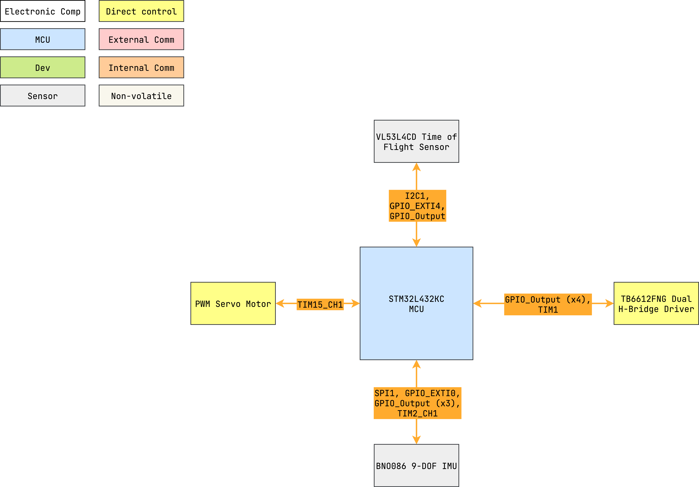

# maze_bot


Terrain and maze solving robot for mechatronics design university course (firmware).

---

<details markdown="1">
  <summary>Table of Contents</summary>

<!-- TOC -->
* [maze_bot](#maze_bot)
  * [1 Overview](#1-overview)
    * [1.1 Bill of Materials (BOM)](#11-bill-of-materials-bom)
    * [1.2 Block Diagram](#12-block-diagram)
    * [1.3 Pin Configurations](#13-pin-configurations)
    * [1.4 Clock Configurations](#14-clock-configurations)
<!-- TOC -->

</details>

---

## 1 Overview

### 1.1 Bill of Materials (BOM)

| Manufacturer Part Number | Manufacturer                         | Description                    | Quantity | Notes |
|--------------------------|--------------------------------------|--------------------------------|---------:|-------|
| NUCLEO-L432KC            | STMicroelectronics                   | 32-bit MCU Nucleo Dev Board    |        1 |       |
| Adafruit BNO085 board    | CEVA Technologies, Inc. via Adafruit | 9-DOF IMU Adafruit board       |        1 |       |
| Adafruit VL53L4CD board  | STMicroelectronics via Adafruit      | ToF Sensor Adafruit board      |        1 |       |
| TB6612FNG driver board   | Toshiba via (Various)                | Dual H-bridge driver board     |        1 |       |
| Hobby servo              | (Various)                            | Generic PWM driven hobby servo |        1 |       |

### 1.2 Block Diagram



> Drawio file here: [maze_bot.drawio](docs/maze_bot.drawio).

### 1.3 Pin Configurations

<details markdown="1">
  <summary>CubeMX Pinout</summary>


</details>

<details markdown="1">
  <summary>Pin & Peripherals Table</summary>

| STM32L432KC | Peripheral              | Config                         | Connection                       | Notes                     |
|-------------|-------------------------|--------------------------------|----------------------------------|---------------------------|
| PB3         | `SYS_JTDO-SWO`          |                                | Onboard ST-Link                  |                           |
| PA14        | `SYS_JTCK-SWCLK`        |                                | Onboard ST-Link                  |                           |
| PA13        | `SYS_JTMS-SWDIO`        |                                | Onboard ST-Link                  |                           |
|             | `TIM2_CH1`              | PWM no output                  |                                  | BNO085 SH2 driver timer.  |
| PA5         | `SPI1_SCK`              |                                | BNO085 Pin 19: `H_SCL/SCK/RX`    |                           |
| PA4         | `GPIO_Output` (SPI1 CS) | Set high                       | BNO085 Pin 18: `H_CSN`           |                           |
| PA6         | `SPI1_MISO`             |                                | BNO085 Pin 20: `H_SDA/H_MISO/TX` |                           |
| PA7         | `SPI1_MOSI`             |                                | BNO085 Pin 17: `SA0/H_MOSI`      |                           |
| PB0         | `GPIO_EXTI0`            | Pull-up, falling edge          | BNO085 Pin 14: `H_INTN`          |                           |
| PB1         | `GPIO_Output`           | Set high                       | BNO085 Pin 6: `PS0/Wake`         | Pull low to trigger wake. |
|             |                         | Hardware pull-up               | BNO085 Pin 5: `PS1`              |                           |
| PA1         | `GPIO_Output`           | Set high                       | BNO085 Pin 11: `NRST`            | Pull low to reset.        |
| PB4         | `GPIO_EXTI4`            | Hardware pull-up, falling edge | VL53L4CD Pin 5: `XSHUT`          |                           |
| PB5         | `GPIO_Output`           | Hardware pull-up               | VL53L4CD Pin 7: `GPIO1`          |                           |
| PB6         | `I2C1_SCL`              |                                | VL53L4CD Pin 10: `SCL`           |                           |
| PB7         | `I2C1_SDA`              |                                | VL53L4CD Pin 9: `SDA`            |                           |
| PA8         | `TIM1_CH1`              | PWM output                     | TB6612FNG Board Pin x: `PWMA`    |                           |
| PA9         | `TIM1_CH2`              | PWM output                     | TB6612FNG Board Pin x: `PWMB`    |                           |
| PA11        | `GPIO_Output`           |                                | TB6612FNG Board Pin x: `DIR_A1`  |                           |
| PA12        | `GPIO_Output`           |                                | TB6612FNG Board Pin x: `DIR_A2`  |                           |
| PA0         | `GPIO_Output`           |                                | TB6612FNG Board Pin x: `DIR_B1`  |                           |
| PB10        | `GPIO_Output`           |                                | TB6612FNG Board Pin x: `DIR_B2`  |                           |
| PA2         | `TIM15_CH1`             | PWM output                     | Hobby Servo Pin x: `PWM`         |                           |

</details>

### 1.4 Clock Configurations

```
16 MHz High Speed External (HSI)
↓
Phase-Locked Loop Main (PLLM)
↓
80 MHz SYSCLK
↓
80 MHz HCLK
↓
 → 80 MHz APB1 (Maxed) → 80 MHz APB1 Timer
 → 80 MHz APB2 (Maxed) → 80 MHz APB2 Timer
```
